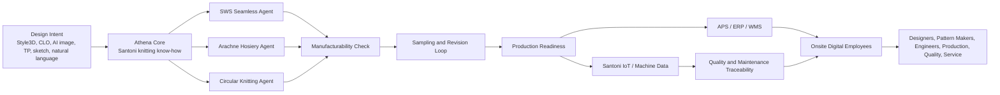

# Athena (Knitting Agent) Structure Handoff v2.0

Prepared for continuing work in the "Athena (Knitting Agent) Structure" thread.

Date: 2026-06-05

## 1. Core Positioning

Athena should not be positioned as a generic "natural language to 3D design" agent.

The sharper positioning is:

> Athena is Santoni's knitting onsite digital workforce, powered by Santoni machine, software, process, and production know-how.

Or in product language:

> Athena connects design intent, knitting engineering, machine execution, and factory operations for seamless, hosiery, and circular knitting customers.

The important distinction:

- Natural language is an interaction layer, not the product moat.
- The moat is Santoni's knitting knowledge, SWS/Arachne workflow, machine data, production engineering, and customer onsite deployment.
- Athena should improve the efficiency of people in OEM/ODM factories. It should not be sold as replacing designers, technicians, or production staff.

## 2. Why This Direction Is Stronger Than "Design Agent"

Style3D rejected an SWS-like collaboration because seamless/hosiery is too small for its horizontal platform economics and requires heavy specialist investment. That does not mean the opportunity is bad for Santoni.

For Style3D:

- Seamless/hosiery is a small vertical market.
- Building SWS-like capability has high resource cost and low standalone software ROI.
- Their platform needs broad apparel-category scale.

For Santoni:

- Athena does not need to monetize only as software.
- It can strengthen machine sales, customer lock-in, service efficiency, training, retrofit, consulting, and lifecycle value.
- A small market can be a moat if the knowledge is deep, machine-specific, and hard for horizontal software companies to replicate.

Important correction:

The seamless/hosiery value chain is shorter, but not simpler. Complexity moves into:

- Stitch structure
- Yarn selection and yarn tension
- Gauge, needle count, and machine constraints
- SWS/Arachne pattern logic
- Machine parameters
- Sizing and washing stability
- Sampling and machine tuning
- Defect root-cause tracing

Therefore the message should be:

> Seamless and hosiery have shorter chains but deeper engineering coupling. This is exactly why Santoni needs an industry agent.

## 3. Product Form

Suggested product form:

> Santoni Onsite Digital Employee System for Knitting Factories

Athena should become a deployable digital workforce at OEM/ODM factories. It should collaborate with:

- Customer designers
- Sampling technicians
- Pattern makers
- Application engineers
- Production supervisors
- Quality teams
- Maintenance engineers
- Planning and functional departments

It should be deployed with workflow templates, not open-ended "build anything by natural language".

Natural language should be used to configure, trigger, query, and explain workflows. The actual workflow execution must remain structured, auditable, permissioned, and maintainable.

## 4. Layered Architecture

### Layer 1: Athena Core

This is the Santoni-owned intelligence layer.

Core knowledge domains:

- Seamless know-how
- Hosiery know-how
- Circular knitting know-how
- SWS workflow and pattern logic
- Arachne workflow and pattern logic
- Machine models, gauges, constraints, and parameters
- Stitch structures
- Yarn properties and yarn behavior
- Common defects and root causes
- Alarm and troubleshooting knowledge
- Sampling, trial production, and production optimization cases

Core tool capabilities:

- File reading and interpretation
- Pattern structure explanation
- Machine and gauge matching
- Stitch and yarn recommendation
- Manufacturability checking
- Risk diagnosis
- Process routing recommendation
- Version comparison
- Sampling issue analysis
- Defect root-cause tracing
- Maintenance and alarm diagnosis

This layer is the moat. It must be built before Athena is expanded into broad workflow automation.

### Layer 2: Workflow Template Layer

Customers should not start from blank workflow design. Santoni should provide templates.

Priority templates:

1. Design request to sampling task
2. Style3D/CLO/AI/image/TP input to SWS/Arachne engineering brief
3. SWS/Arachne file review and risk checking
4. Sampling issue to revision suggestion
5. Machine alarm to troubleshooting workflow
6. Production abnormality to root-cause analysis
7. Quality defect to process/machine/yarn tracing
8. Order to production feasibility and lead-time risk
9. APS plan to onsite execution risk warning
10. Service ticket to remote diagnosis and knowledge retrieval

Natural language can help users create variants of these templates, but every template needs:

- Input objects
- Output objects
- Responsible roles
- Permissions
- Trigger conditions
- Escalation path
- Evidence log
- KPI

### Layer 3: Data and System Integration Layer

Required Santoni-side modules:

- Santoni IoT
- Santoni APS
- SWS
- Arachne
- Machine alarm and maintenance data
- Optional WMS and other Santoni modules

Customer-side systems to connect when available:

- ERP
- CRM
- MES
- PLM
- WMS
- Quality systems

Data access should be staged. Do not try to integrate every system in the first deployment.

Recommended integration priority:

1. SWS/Arachne + Santoni IoT + sampling/quality feedback
2. APS + ERP
3. WMS
4. CRM
5. PLM/MES and broader enterprise systems

### Layer 4: Onsite Digital Employees

Athena should be packaged as role-based digital employees, not one vague super-agent.

Initial digital employees:

1. Sampling Assistant
   - Helps translate customer design intent into SWS/Arachne tasks.
   - Checks feasibility and highlights risk.

2. Pattern Engineering Assistant
   - Reads SWS/Arachne logic.
   - Explains structures, suggests stitch/yarn/machine choices, compares versions.

3. Application Engineer Assistant
   - Supports machine setup, tuning, training, and customer troubleshooting.

4. Production Supervisor Assistant
   - Reads APS and IoT data.
   - Warns about capacity, delay, machine abnormality, and execution risk.

5. Quality Traceability Assistant
   - Links defects to pattern version, machine, yarn, process, operator, and IoT events.

6. Maintenance Assistant
   - Interprets alarms, suggests checks, predicts spare parts and maintenance windows.

7. Customer Collaboration Assistant
   - Translates factory constraints back into customer-facing language.
   - Helps explain why a design needs revision and what trade-offs exist.

## 5. Capability Enhancement After Connecting IoT, APS, ERP, CRM

If Athena can access Santoni IoT, APS, customer ERP, and CRM, its capability can move from "assistant" to "factory-level digital employee".

Key enhancements:

### 5.1 Production Feasibility Decision

Athena can answer:

- Can we accept this order now?
- Which machine should run it?
- What is the expected sampling time and production time?
- Which stitch/yarn/size combinations are risky?
- What must be changed if the customer wants faster delivery?

### 5.2 Dynamic Quotation and Lead-Time Promise

With ERP, APS, WMS, and historical data, Athena can estimate:

- Machine hours
- Yarn consumption
- Sampling effort
- Changeover cost
- Capacity conflict
- Delivery risk
- Margin impact

This is valuable because many OEM factories still quote and promise lead time mainly by experience.

### 5.3 APS Risk Warning

With APS plan + IoT execution data, Athena can identify:

- Planned output is behind real machine progress.
- A machine has abnormal stop rate.
- A yarn batch causes more alarms.
- A rush order will damage other delivery commitments.
- A style should be split, resequenced, or moved to another machine.

### 5.4 Quality Root-Cause Tracing

Athena can connect:

- Defect type
- SWS/Arachne pattern version
- Stitch structure
- Yarn lot
- Machine model
- Machine parameter
- Alarm history
- Operator action
- Sampling revision

This is one of the strongest Santoni moat areas.

### 5.5 Predictive Maintenance and Service

IoT data can support:

- Machine health score
- Alarm trend analysis
- Maintenance window recommendation
- Spare part prediction
- Remote diagnosis
- Service knowledge retrieval

This can reduce Santoni service workload and increase customer dependence on Santoni's ecosystem.

### 5.6 Customer Memory and Proposal

With CRM and order history, Athena can remember:

- Customer preferences
- Common complaints
- Tolerance on lead time, color, compression, fit, hand feel, and quality
- Successful past products
- Failed past products
- Key contacts and decision patterns

This enables proactive proposals, but it should not be the first build priority.

## 6. Priority Roadmap

### Phase 0: Narrow Proof of Value

Focus on one closed loop:

Customer design/request -> SWS/Arachne engineering brief -> manufacturability check -> sampling feedback -> revision suggestion -> production readiness.

Do not start with all Santoni business lines and all customer systems.

### Phase 1: Build Athena Core for One Vertical

Choose either seamless or hosiery first. Do not build seamless, hosiery, and circular knitting equally at the start.

Suggested first vertical:

- If business priority is machine ecosystem control: seamless.
- If data and Arachne workflow are more mature: hosiery.
- If customer pilot is stronger in one area: follow the pilot.

### Phase 2: Add Role-Based Digital Employees

Start with 2-3 roles only:

- Sampling Assistant
- Pattern Engineering Assistant
- Quality Traceability Assistant

Only add Production Supervisor and Maintenance after IoT/APS data quality is good enough.

### Phase 3: Integrate APS and IoT

Move from pattern/sampling intelligence to onsite operation intelligence.

Main outputs:

- Capacity risk
- Machine risk
- Production abnormality
- Quality root cause
- Maintenance suggestion

### Phase 4: Connect ERP/CRM

Enable business-level intelligence:

- Quotation
- Lead time
- Order priority
- Customer memory
- Proactive proposal
- Sales/service collaboration

## 7. Product Risks

### Risk 1: Becoming a Digitalization Contractor

If Athena tries to implement every customer's workflow, ERP, CRM, APS, WMS, and custom reports, it will become a services business, not a scalable product.

Mitigation:

- Keep a standard core.
- Use templates and configuration.
- Separate industry product from customer-specific integration work.

### Risk 2: Building a Chatbot Instead of an Agent

If Athena only answers questions without writing files, triggering actions, checking risk, or closing loops, it will not change factory productivity.

Mitigation:

- Every digital employee must have inputs, outputs, tools, and KPIs.

### Risk 3: Waiting for Complete Knowledge

"Athena needs all Santoni know-how" is strategically true but operationally dangerous.

Mitigation:

- Pick one high-value closed loop.
- Build depth before breadth.
- Capture expert knowledge through real cases, not abstract documentation projects only.

### Risk 4: Underestimating Data Governance

ERP/CRM/IoT data is often incomplete, inconsistent, or not trusted.

Mitigation:

- Start with controlled data objects.
- Add data quality score.
- Keep evidence trace for every AI recommendation.

### Risk 5: Style3D Moves Downstream

Style3D is already showing production-file, print-layout, ERP, Python automation, and supplier collaboration use cases.

Mitigation:

- Santoni must focus on machine-specific knitting engineering that horizontal 3D platforms cannot easily own.

## 8. Recommended Product Narrative

Avoid:

> Athena is a natural language 3D design agent.

Use:

> Athena is Santoni's knitting onsite digital workforce. It helps OEM/ODM factories convert design intent into machine-ready knitting production, improve sampling efficiency, reduce production risk, and preserve Santoni process know-how.

Short English version:

> Athena: Santoni's onsite digital workforce for knitting engineering and production operations.

Short Chinese version:

> Athena: Santoni 针织现场数字员工系统。

## 9. Suggested Architecture Diagram for Next Thread

## 10. Direct Prompt to Continue in the Other Thread

Use this in the "Athena (Knitting Agent) Structure" conversation:

> Please update Athena's product architecture based on the new positioning: Athena is Santoni's knitting onsite digital workforce, not a generic natural-language design agent. It should focus on seamless, hosiery, and circular knitting, with Athena Core as the Santoni know-how layer, workflow templates for OEM/ODM deployment, system integrations with Santoni IoT/APS/SWS/Arachne and customer ERP/CRM/MES/WMS where available, and role-based digital employees for sampling, pattern engineering, production supervision, quality traceability, maintenance, and customer collaboration. Use the handoff file `athena_knitting_agent_structure_handoff_v2.md` as the basis. Be critical about scope creep and avoid turning Athena into a generic digitalization contractor.

## 11. Related Support File

Existing broader summit report:

`C:\Users\rem_i\OneDrive - Santoni (Shanghai) Knitting Machinery Co., Ltd\文档\Product\AI Knitting Agent\marketing intelligence\style3d_ai3d_summit_santoni_agent_report.html`

